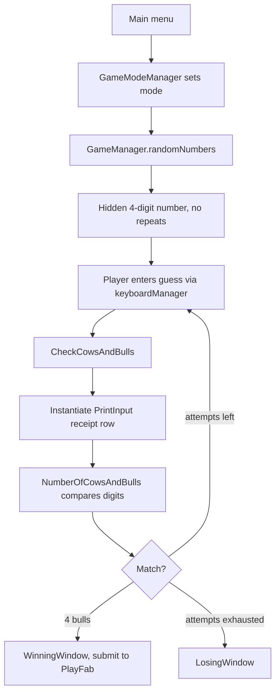

# Architecture

Cows & Bulls is a single-scene-per-screen Unity project built around a set of persistent singleton managers, with gameplay state held in `GameManager` and cross-cutting concerns (sound, save data, game mode, leaderboard, localization) split into their own always-alive objects.

Unity 2020.3.34f1 · C# · PlayFab · DOTween / LeanTween

---

## Manager layer

Five managers survive scene loads via `DontDestroyOnLoad` and enforce a single instance in `Awake`:

| Manager | Responsibility |
|---|---|
| `GameModeManager` | Holds the selected `GameMode` so the gameplay scene knows what to load |
| `SoundManager` | Audio playback, including randomized effect variants |
| `DataPristinceManager` | Owns save/load, discovers `IDataPrisistence` implementers |
| `PlayFabManager` | Login, leaderboard submission, leaderboard retrieval |
| `LocalizationManager` | Language switching between Arabic and English |

The pattern is the standard Unity singleton: assign `Instance` if unset, otherwise destroy the duplicate, then persist.

```csharp
if (Instance == null) { Instance = this; }
else if (Instance != this) { Destroy(gameObject); }
DontDestroyOnLoad(gameObject);
```

**Trade-off.** Singletons made cross-scene state trivial for a solo three-month project — any script can reach `SoundManager.Instance` without wiring references through inspectors. The cost is hidden coupling: dependencies do not appear in constructors or the inspector, so nothing can be tested in isolation and initialization order is implicit. On a team, or with more time, a service locator or dependency injection would make those edges visible.

## Game loop



## Guess evaluation

Hidden number generation rejects duplicates by resampling until the digit is unused:

```csharp
for (int j = 0; j < Lenght; j++)
{
    Rand = Random.Range(0, 10);
    while (hiddenNumberList.Contains(Rand))
        Rand = Random.Range(0, 10);
    hiddenNumberList.Add(Rand);
}
```

Comparison happens in `PrintInput.NumberOfCowsAndBulls()` — a positional pass that counts a **bull** for a digit matching in place and a **cow** for a digit present elsewhere. Because the hidden number has no repeated digits, the naive count is correct; with repeats allowed, this comparison would need the standard two-pass min-count algorithm to avoid double-counting.

Each guess is instantiated as a prefab row parented to a scrolling container, animated in with LeanTween. The receipt-printer metaphor is the reason results are spawned as physical rows rather than written into a static list.

## Persistence

`DataPristinceManager` finds every component implementing `IDataPrisistence`, then delegates file work to `FileDataHandler`, which serializes `GameData` to JSON in `Application.persistentDataPath`.

`FileDataHandler` includes an optional XOR pass over the serialized string:

```csharp
modifiedData += (char)(data[i] ^ encryptionCodeWord[i % encryptionCodeWord.Length]);
```

**This is obfuscation, not encryption**, and it is currently disabled (`useEncryption = false`). A fixed, short, in-binary key gives no confidentiality — it only stops casual editing of the save file in a text editor. For a single-player puzzle game with no purchasable state that is an acceptable position, but it should not be described as encryption.

## Online features

**Leaderboard.** `PlayFabManager` authenticates the device and submits scores to a PlayFab statistic, then reads the leaderboard back for display. Players may generate a random display name to skip the naming step.

**Result sharing.** Guess history is composed into a single camera view, captured as one image, and passed to `NativeShare` with a message — so a player shares one picture of the whole game rather than a screenshot of the visible scroll region.


## Localization

Built on Unity's Localization package. `LocalizationManager` maps a dropdown selection onto `LocalizationSettings.SelectedLocale`.

**Known fragility.** Locales are selected by array index:

```csharp
LocalizationSettings.SelectedLocale = LocalizationSettings.AvailableLocales.Locales[0];
```

`AvailableLocales.Locales` has no guaranteed order, so adding a third language — or a change in load order — silently remaps the existing dropdown entries. Selecting by locale code rather than index would remove the coupling.

## Third-party packages

| Package | Used for |
|---|---|
| PlayFab SDK | Leaderboard and player data |
| DOTween / LeanTween | Receipt animation, UI motion |
| NativeShare | Native share sheet on iOS and Android |
| EasyTransitions | Scene transition effects |
| Unity Localization | Language switching |
| Addressables | Localization asset loading |
