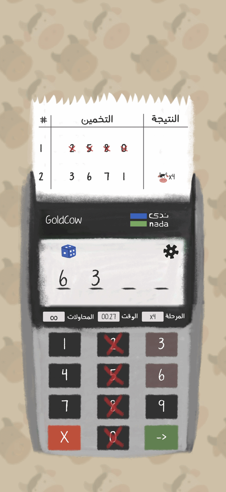

<div align="center">
  

  <h1>Cows &amp; Bulls</h1>

  <p><strong>A number guessing game you play on a receipt printer.</strong></p>

  <p>
    
    
    
    
  </p>

  <br/>

  
</div>

---

## About

Cows & Bulls is a logic-based number guessing game I built solo over three months. The rules are old — people have played this with pencil and paper for generations — but the presentation is the part I cared about.

A friend who loved the pen-and-paper version pushed me to make a digital one. Instead of putting the game in a normal app UI, I built the whole thing as a **card payment terminal**: you type your guess on its keypad, and the machine prints your result on a paper receipt that feeds out of the top. Every element belongs to the device — the keypad, the display, the timer strip, the printed slip. That one decision drove most of the game's UI work, and it's the reason results look like a receipt rather than a scrolling table.

The art is hand-painted rather than vector, which is what keeps the machine feeling like an object you're holding instead of a diagram of one.

**Role:** Solo developer · **Duration:** 3 months · **Engine:** Unity 6000.4.7f1

## How to play

The game picks a four-digit number with no repeating digits. You guess, and the machine prints back two counts:

- A **bull** is a correct digit in the correct position.
- A **cow** is a correct digit in the wrong position.

Guess `1234` against a hidden `1439` and you get one bull (the `1`) and two cows (the `3` and the `4`). From there it's deduction — each printed slip narrows down what's left.

## Features

### Deduction marks that carry onto the receipt


Players were tracking possibilities on paper next to the phone, so I moved that into the machine. Tapping a digit on the keypad marks it — `X` for ruled out, `O` for likely — and the mark stays for the rest of the round.

The part I like most is that the marks follow the digits onto the printed receipt: a guess whose digits you've since eliminated prints with those digits struck through, so an old slip tells you at a glance that it's already been ruled out. The scratchpad and the history end up being the same surface.

### Online leaderboard

<div>
  
  
</div>

Scores are stored through the **PlayFab API**. A dedicated manager handles authentication, submits statistics after a win, and reads the leaderboard back for display. Players who don't want to think about a name can generate a random one and get straight into a game.

### Sharing a finished game


A screenshot of a scrolling board only captures whatever happens to be on screen, which is rarely the interesting part. Instead, the full receipt is composed into a separate camera view and captured as a single render, then handed to the native share sheet with a message — so what gets shared is the whole game, not a fragment of it.

### Arabic and English

The whole interface runs through Unity's Localization package with string tables for both languages, switchable from settings without restarting.

## Under the hood

Five managers persist across scenes and own one concern each — sound, save data, game mode, leaderboard, and localization — while `GameManager` holds the state of the current round.

Guesses are spawned as prefab rows into a scrolling container. The receipt animation works by offsetting the whole container downward and tweening it back, so everything above the new slip moves as one rigid sheet instead of as thirty independently animated rows.

Save data is serialized to JSON in the platform's persistent data path, gathered from any component implementing `IDataPrisistence`.

Full write-up: **[ARCHITECTURE.md](https://github.com/we-dad/CowsAndBullsGame/blob/2adb966f7413ad5de94082a51e2f475ed862e0fc/Architecture.md)**

## Problems worth reading about

Three months solo produced a few things worth documenting properly — why the obvious approaches to the receipt animation didn't work, how to share a scrolling board as one image, and a localization design that's fragile in a way that doesn't show up in code review.

They're written up in **[CHALLENGES.md](https://github.com/we-dad/CowsAndBullsGame/blob/2adb966f7413ad5de94082a51e2f475ed862e0fc/Challenges.md)**.

## Running it

```bash
git clone https://github.com/we-dad/CowsAndBullsGame.git
```

Open the project in **Unity 6000.4.7f1**. PlayFab needs a title ID configured in its settings asset before the leaderboard will connect; everything else runs offline.

Ads were removed in v2.9.0 — the game ships with no monetization.

## Built with

| | |
|---|---|
| **PlayFab SDK** | Leaderboard and player data |
| **DOTween / LeanTween** | Receipt animation and UI motion |
| **NativeShare** | Native share sheet on iOS and Android |
| **Unity Localization** | Arabic and English string tables |
| **Addressables** | Localization asset loading |
| **EasyTransitions** | Scene transitions |
